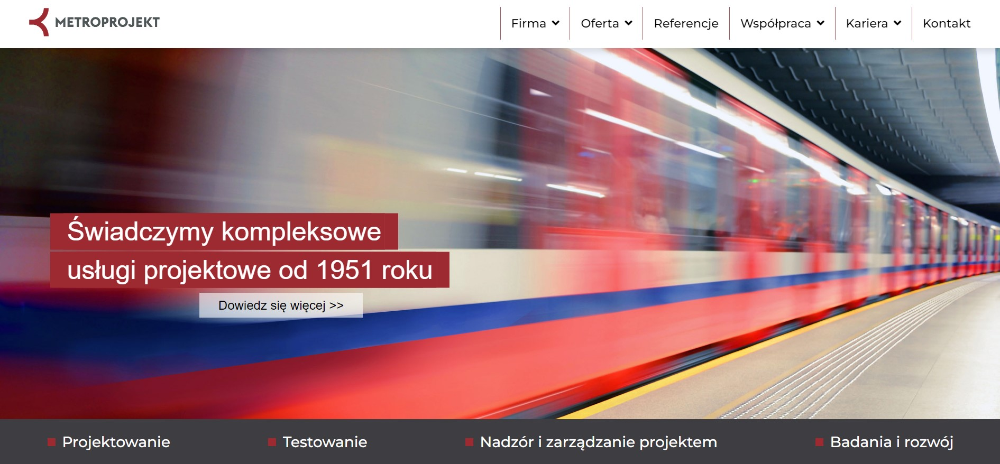
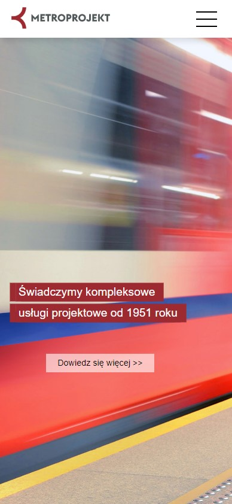

## Table of contents
* [General info](#general-info)
* [Technologies](#technologies)
* [Author](#author)
* [Screenshots](#screenshots)
* [Live](#live-star2)

## General info
Railway - webpage

## License - Creative Commons Non-Commercial (CC BY-NC) License 

This work is licensed under a Creative Commons Non-Commercial (CC BY-NC) License (not for commercial use)

## Technologies
* HTML5
* CSS3
* JavaScript

## Screenshots
* Desktop version :computer:     

 

* Mobile version :iphone:     

 

## Live :star2:
https://goldipl.github.io/Railway_Website_new/